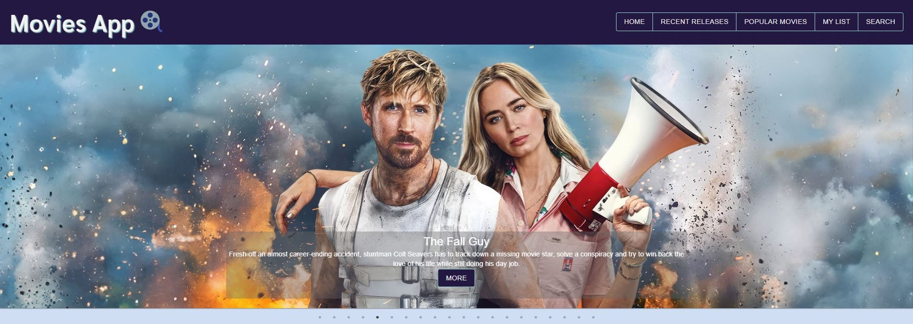
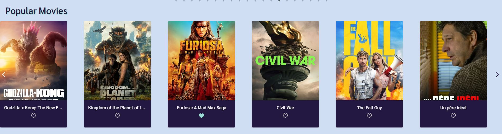
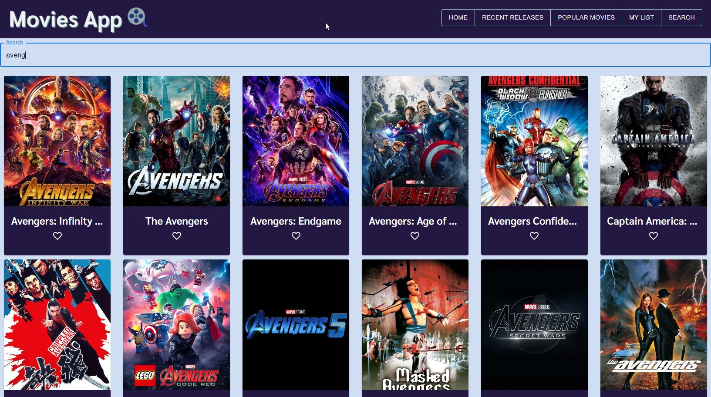
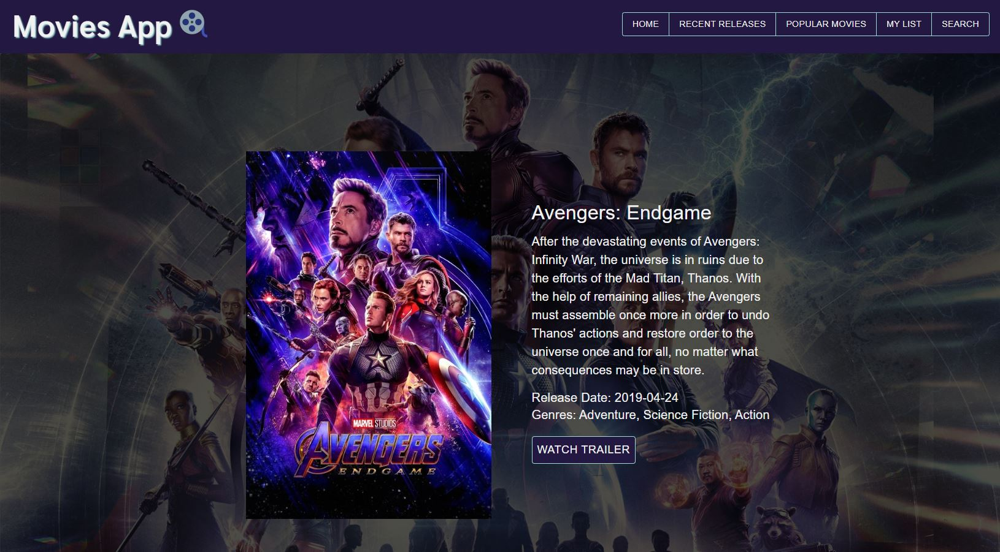

# Proyecto Movies App

Hola! Soy Jimena Taleb, tengo 31 años, vivo en Córdoba Capital y estudio en Ada ITW desarrollo Frontend.
***

### Descripción
Movies App es una aplicación donde los usuarios podrán buscar diferentes películas. La app cuenta con una ventana principal
con un menú de navegación para acceder a otras secciones como lanzamientos recientes, películas populares o mi lista. Incluso
cuenta con un buscador para encontrar aquellas películas que no aparezcan en las demás vistas.
Los usuarios podrán agregar sus películas favoritas a una lista y también podrán encontrar más información sobre cada película como la
fecha de lanzamiento, los géneros, una sinopsis de la misma y el trailer.
La aplicación se desarrolló utilizando las nuevas herramientas aprendidas: React JS con Vite ya que se aplican conceptos como React Router Dom, customHooks y Axios
para acceder a los datos de la API de TMDB.

***

### Herramientas
- HTML5
- Vite
- ReactJs
- Axios
- React Icons
- MUI- Material UI
- React Slick
- Git
- GitHub

***

### Deploy 🎥
Se puede visualizar el proyecto desde cualquier naegador ingresando al siguiente link: 
https://movies-app-by-ji.vercel.app

***

### Preview

